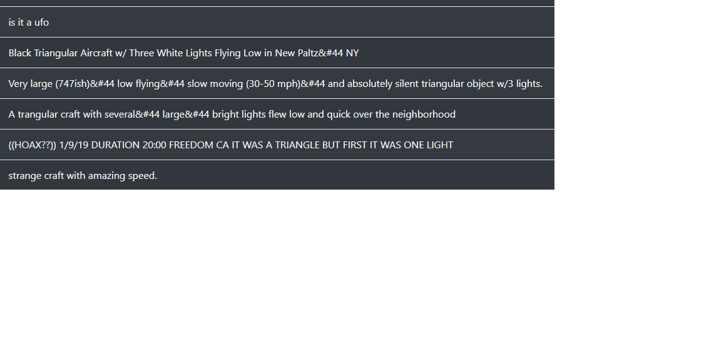

# Overview of Project
## 
## The purpose of this project was to take a prexisting data set of UGO sightings and build an interactive javascript-based website to filter the data to whatever spesifications they need. A combination of Javascript, CSS, and bootstrap were all utalized in the creation of this webpage 
# Results
## The webpage works based on the search filter table on the left hand side of the sight, where users can filter dates, cities, states, countries, and aircraft shapes to whatever spesifications they would like.
## 
## However, the data is only as good as the users that provide it: some of the explinations can be a bit...lacking. Detail, spelling, grammar, since all the data is user submitted there is not a great deal of quality control for the content that is submitted by a wide variety of people, which can muddy the data a bit. 
## 
